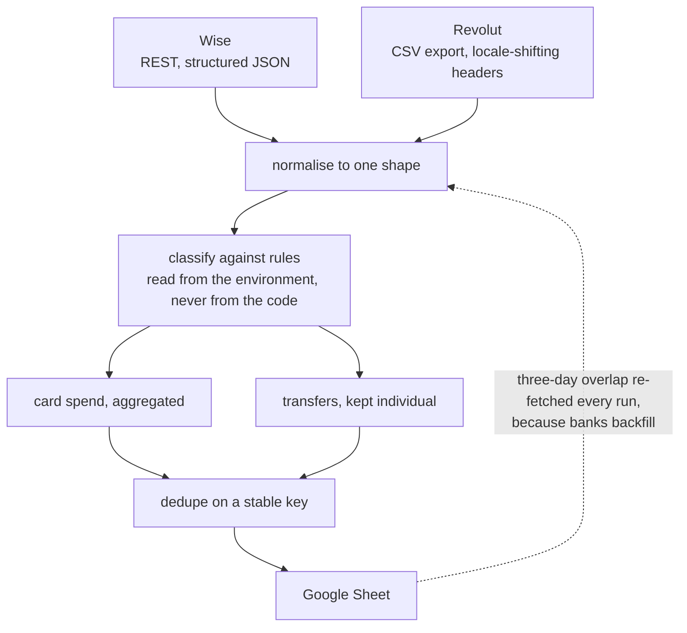

# bank-transfers-tracker

[](https://github.com/sevamrk/bank-transfers-tracker/actions/workflows/ci.yml)

Pulls transactions from two banks that have nothing in common, works out what each one
*was*, and keeps a spreadsheet in sync without creating duplicates.

It is a small tool with an awkward problem underneath it, which is why it has tests.

## The problem

Personal finances spread across two providers give you two incompatible views:

- **Wise** has a REST API, returns structured JSON, and knows a transfer's destination.
- **Revolut** (personal accounts) has no API. You export a CSV — and the column headers,
  the transaction-type words and the decimal punctuation all change with the account's
  locale.

Neither tells you what a transaction *meant*. A €1,500 transfer to your own account is not
income. A card payment to a supermarket is not worth its own row. Money arriving from the
person you share a flat with is rent when it is large and utilities when it is small.

The work is not "call an API". It is: normalise two shapes into one, classify each row
against rules that are personal by nature, and stay idempotent across re-runs.

## How it works



Running it twice produces the same sheet. That is the whole difficulty: the
overlap window has to exist, and it has to not create duplicates.

## Design notes

**Every personal rule is configuration, not code.** Which names count as your own, what a
recurring allowance looks like, who pays you rent and above what threshold — all of it comes
from the environment. The code ships knowing nothing about any particular person. That is
not decoration: the first version of this hardcoded real names and real amounts into
`sync.py`, and it was the reason the repo could not be published.

**The CSV parser is locale-tolerant by construction.** Column names are matched through an
alias table (`src/revolut_client.py`), rather than assuming an English export. The same file
handles Russian and English statements without a flag.

**Re-running is safe.** A three-day overlap window is re-fetched every sync deliberately —
banks backfill — and rows are deduplicated on a stable key before anything is written
(`src/state.py`, `src/sheets.py`). Running twice produces the same sheet.

**Card spending aggregates; transfers stay individual.** Two hundred supermarket rows tell
you nothing. One monthly total does. Transfers between named people are the opposite.

## Running it

```bash
python3 -m venv .venv && source .venv/bin/activate
pip install -e .
cp .env.example .env      # then fill it in
python main.py --help
```

`.env` holds credentials and the personal classification rules. It is gitignored, and
`.env.example` documents every value.

## Tests

```bash
pip install pytest && pytest
```

35 tests. They cover the parts that break quietly rather than loudly: locale-dependent CSV
parsing, the categorisation rules, deduplication, and aggregation arithmetic. Every fixture
value is fabricated — the names are famous scientists, and the amounts are invented.

## Layout

| Path | Does |
|---|---|
| `src/wise_client.py` | Wise REST API — balances, incoming and outgoing transactions |
| `src/revolut_client.py` | CSV statement parsing, locale-tolerant |
| `src/sync.py` | Normalisation, classification, aggregation |
| `src/sheets.py` | Google Sheets writes, deduplicated |
| `src/state.py` | Sync cursor, so re-runs stay cheap |
| `RESEARCH.md` | What was evaluated before building — including the approaches rejected |

`RESEARCH.md` is kept deliberately. The interesting part of this project was discovering
that Revolut's personal accounts have no API at all, which is what forced the CSV path.

## Make it yours

Four things, in this order:

1. `.env` — the account names, the allowance amount, who pays rent and above what
   threshold. All of it is yours and none of it is in the code.
2. `src/revolut_client.py` — the column alias table. If your export is in a third
   locale, add its headers here and nothing else changes.
3. `src/sync.py` — the classification rules. They encode one household's idea of what
   a transaction meant; yours will differ.
4. `src/sheets.py` — the sheet layout, if you want different columns.

## Limitations

**Revolut still needs a human.** There is no personal API, so someone downloads a CSV
and drops it in a folder. Everything after that is automatic, and that first step is
not. A headless browser could do it and would break every time the export page moves.

**It is single-user by construction.** One `.env`, one sheet, one set of rules. Making
it multi-tenant means moving the rules into a store and keying everything by owner,
which is a different program.

**Classification is rules, not a model.** A transfer that is rent one month and a loan
repayment the next needs a human to say so. Rules were the right call here — a
misclassified row in your own accounts is worse than an unclassified one — but the
ceiling is real.

**Google Sheets is the weakest link.** It is the right output because it is what gets
read, and it is the wrong store because a spreadsheet has no schema. The dedup key
protects the rows; nothing protects a column somebody drags.

## Provenance

Written for my own accounts, then rewritten for publication. Every personal rule that
used to be hardcoded is configuration now, which is both why it can be published and
the better design. The fixtures are fabricated: the names are famous scientists and
every amount is invented.
